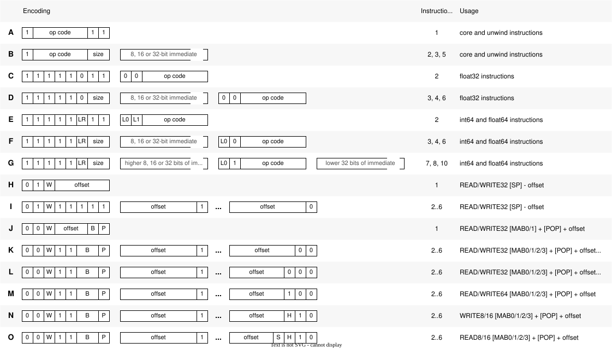

# Instructions

triVM has variable length instruction encoding.

## Encoding

triVM has variable length instruction encoding.
Instruction encoding was designed to balance the instruction size
and complexity of decoding it.

Various types of encoding are named using letters from A to S.
Following diagrams shows each of the encoding type.



Immediate values are encoded in little endian byte order.

Immediate value in encodings B, C, F, G, J, K is always sign
extended to 32-bit integer before executing the instruction.

Immediate value in encodings M, N is always sign
extended to 64-bit integer before executing the instruction.

Flags LR, L0, L1 cannot be all zeros in a single instruction.

The same `op code` value, but used in a different encodings may indicate different instructions.

Encodings R and S contains series of 7-bit chunks for offset value.
Bit 8 indicates that there are more chunks. Last chunk has eight bit cleared.
This allows virtually unlimited instruction size,
but it does not make sense to provide more bits than 32-bit integer can hold.

Unlike immediate value, offset value is encoded in a big endian order.
One or two most significant bits are in the first byte.
The last byte contains 7 least significant bits.

Depending on configuration, not all encodings are always used.
Following table shows which encodings are used by each instruction set extension.

|       |A|B|C|D|E|F|G|H|I|J|K|L|M|N|O|P|Q|R|S
|-------|-|-|-|-|-|-|-|-|-|-|-|-|-|-|-|-|-|-|-
|Core   |X|X|X|X| | | | | | | | | | | | |X|X|X
|Unwind |X|X|X|X| | | | | | | | | | | | | | |
|Float32| | | | |X|X|X|X| | | | | | | | | | |
|Int64  |X|X|X|X| | | | |X|X|X|X|X|X|X|X| | |
|Float64|X|X|X|X| | | | |X|X|X|X|X|X|X|X| | |

> TODO: Split encoding diagram and add specific encoding image for each instruction.

## Instruction set summary

### [Core]() instruction set

|   Name     | Operation
|------------|----------
|             **Binary operations**
| [ADD]()    | result = value1 + value2
| [SUB]()    | result = value1 - value2
| [MUL]()    | result = value1 * value2
| [AND]()    | result = value1 & value2
| [OR]()     | result = value1 \| value2
| [XOR]()    | result = value1 ^ value2
| [UDIV]()   | result = value1 / value2 *(unsigned)*
| [SDIV]()   | result = value1 / value2 *(signed)*
| [UMOD]()   | result = value1 % value2 *(unsigned)*
| [SMOD]()   | result = value1 % value2 *(signed)*
| [SHL]()    | result = value1 << (value2 & 31)
| [USHR]()   | result = value1 >> (value2 & 31) *(unsigned)*
| [SSHR]()   | result = value1 >> (value2 & 31) *(signed)*
| [EXTS]()   | result = (value1 << (value2 & 31)) >> (value2 & 31) *(signed)*
| [EQ]()     | result = value1 == value2
| [ULT]()    | result = value1 < value2 *(unsigned)*
| [SLT]()    | result = value1 < value2 *(signed)*
|             **Unary operations**
| [EQZ]()    | result = !value1
| [NEG]()    | result = -value1
|             **Branch**
| [BR]()     | Branch unconditionally
| [BRT]()    | Branch if true
| [BRF]()    | Branch if false
| [CALL]()   | Call a function
|             **Host interface**
| [HOST]()   | Call host functions
| [HRET]()   | Return to host
|             **Memory access**
| [READ]()   | Read value from memory
| [WRITE]()  | Write value to memory


### [Unwind]() extension

|   Name     | Operation
|------------|----------
| [UNWIND]() | Unwind the stack

### [Mem64]() extension

|   Name     | Operation
|------------|----------
| [READ64]()   | Read 64-bit value from memory
| [WRITE64]()  | Write 64-bit value to memory

### [Int64]() extension

|   Name     | Operation
|------------|----------
|             **Binary operations**
| [ADD64]()    | result = value1 + value2
| [SUB64]()    | result = value1 - value2
| [MUL64]()    | result = value1 * value2
| ...          | ...

### [Float32]() extension

|   Name     | Operation
|------------|----------
| [ADDF]()   | result = value1 + value2
| [CONVF]()** | ...
| ...        |

\* - available if Int64 extension is also enabled  
\*\* - available if Float64 extension is also enabled

### [Float64]() extension

|   Name     | Operation
|------------|----------
| [ADDD]()   | result = value1 + value2
| [CONVD]()** | ...
| ...        |

\* - available if Int64 extension is also enabled  
\*\* - available if Float32 extension is also enabled


## Binary operation instructions

 * Encoding A
   ```
   ..., value1, value2 →
   ..., result
   ```
 * Encoding B, C, D
   ```
   ..., value1 →
   ..., result
   ```
   `value2 = immediate`
  
Division and modullo instructions can raise an [Division By Zero]() VM Fault.

Opcode | Name | Operation Pseudo Code
-------|------|----------
0x02 |   ADD    | `result = value1 + value2`
0x03 |   SUB    | `result = value1 - value2`
0x04 |   MUL    | `result = value1 * value2`
0x05 |   AND    | `result = value1 & value2`
0x06 |   OR     | `result = value1 \| value2`
0x07 |   XOR    | `result = value1 ^ value2`
0x08 |   UDIV   | `result = value1 / value2` *(unsigned)*
0x09 |   SDIV   | `result = value1 / value2` *(signed)*
0x0A |   UMOD   | `result = value1 % value2` *(unsigned)*
0x0B |   SMOD   | `result = value1 % value2` *(signed)*
0x0C |   SHL    | `result = value1 << (value2 & 31)`
0x0D |   USHR   | `result = value1 >> (value2 & 31)` *(unsigned)*
0x0E |   SSHR   | `result = value1 >> (value2 & 31)` *(signed)*
0x0F |   EXTS   | `result = (value1 << (value2 & 31)) >> (value2 & 31)` *(signed)*
0x10 |   EQ     | `result = value1 == value2`
0x11 |   ULT    | `result = value1 < value2` *(unsigned)*
0x12 |   SLT    | `result = value1 < value2` *(signed)*

## Unary operation instructions

 * Encoding A
   ```
   ..., value1 →
   ..., result
   ```
 * Encoding B, C, D
   ```
   ... →
   ..., result
   ```
   `value1 = immediate`

Opcode | Name | Operation Pseudo Code
-------|------|----------
0x13 |   EQZ    | `result = !value1`
0x14 |   NEG    | `result = -value1`

## Branch instructions

### BRT, BRF

 * Encoding A
   ```
   ..., value1, value2 →
   ...
   ```
 * Encoding B, C, D
   ```
   ..., value1 →
   ...
   ```
   `value2 = immediate`

Operation:
```
BRT: if (value1) PC += value2
BRF: if (value1) PC += value2
```

### BR

 * Encoding A
   ```
   ..., value1 →
   ...
   ```
 * Encoding B, C, D
   ```
   ... →
   ...
   ```
   `value1 = immediate`

Operation:
```
PC += value1
```

### CALL

 * Encoding A
   ```
   ..., value1 →
   ..., return_address
   ```
 * Encoding B, C, D
   ```
   ... →
   ..., return_address
   ```
   `value1 = immediate`

Operation:
```
return_address = PC
PC += value1
```

### EXT

 * Encoding A
   ```
   ..., value1 →
   ...
   ```
 * Encoding B, C, D
   ```
   ... →
   ...
   ```
   `value1 = immediate`

Operation:
```
if (value1 == 0xFFFFFFFF) inform host that guest routine has finished
else call external native function with id = value1
```

## Memory access instructions

### READ offset
```
... →
..., result
```
* Encoding Q: `result = 32-bit integer from address: 4 * offset`
* Encoding R: `result = 32-bit integer from address: 4 * sign extended offset`

### READ [SP] + offset
```
... →
..., result
```
* Encoding Q and R: `result = 32-bit integer from address: SP + 4 * offset`

### READ [POP] + offset
```
..., popped_address →
..., result
```
* Encoding Q and R: `result = 32-bit integer from address: popped_address + 4 * offset`

### READ\[B|H|SB|SH] \[IMP] + \[POP] + offset
```
..., popped_address →
..., result
```
* Encoding Q and R: `result = 32-bit integer from address: IMP popped_address + 4 * offset`

Instruction | Encoding | Base | B | S |Address | Operation
------------|--|----|---|---|----|----------
READB \[POP] + offset | S | 2 | 1 | 0 | popped_address + offset | read 8-bit integer
READB \[IMP] + \[POP] + offset | S | 3 | 1 | 0 | IMP register + popped_address + offset  | read 8-bit integer
READSB \[POP] + offset | S | 2 | 1 | 1 | popped_address + offset | read 8-bit integer and sign extend it to 32 bits
READSB \[IMP] + \[POP] + offset | S | 3 | 1 | 1 | IMP register + popped_address + offset  | read 8-bit integer and sign extend it to 32 bits
READH \[POP] + offset | S | 2 | 0 | 0 | popped_address + offset | read 16-bit integer
READH \[IMP] + \[POP] + offset | S | 3 | 0 | 0 | IMP register + popped_address + offset  | read 16-bit integer
READSH \[POP] + offset | S | 2 | 0 | 1 | popped_address + offset | read 16-bit integer and sign extend it to 32 bits
READSH \[IMP] + \[POP] + offset | S | 3 | 0 | 1 | IMP register + popped_address + offset  | read 16-bit integer and sign extend it to 32 bits


