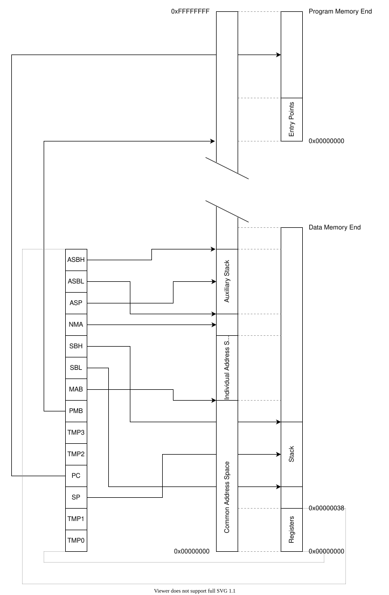

# Memory

triVM has two memories:
 * **data memory** - memory for operational data,
 * **program memory** - memory containing program code and pre-initialized data.

Both memories are mapped into common address space
that is used by the memory access instructions `LOAD` and `STORE`.
Stack can only be located in the data memory.
Instructions can be only executed for the program memory.

## Memory models

The triVM allows flexibility of memory size management.
Configuration options defines what is the memory size and how it can change.

> [!WARNING]
> This feature is no fully implemented yet.
> You can only use **Fixed memory** with **Minimum and maximum** that are the same.

There are following basic memory management cases:
* **Fixed memory** - during initialization, host provides specific memory buffer and it is never changed.
  * **Minimum and maximum are the same** - host provides memory size that is always
  the same and it is known at compile time.
  * **Minimum and maximum are different** - host can provide memory size that in specific range.
* **Growable** - during initialization, host provides initial memory buffer. Guest may request more memory and host will reallocate the buffer to fulfill the guest request or it may report failure to the guest.

  Minimum size tells what is the minimum memory size that host can provide during initialization.
  Maximum size tells how big memory can grow.

> [!NOTE]
> This section describes a size available for the guest.
> Memory needed by the virtual machine is actually slightly bigger to store
> internal state.

## Memory organization

Below diagram shows how the memory in triVM is organized.

Arrows from registers show where the address is pointing.
If arrow points to Common Address Space,
then the register should be interpreted as address in Common Address Space.
If to Program Memory, then as address in Data Memory.
And, the same for Data Memory.

## Common Address Space

Individual Address Space and Auxiliary Stack are shown in the diagram as
separate parts of data memory.
Actually, they can be located anywhere in the Common Address Space.
They can also overlap with any other part of memory, e.g. stack, registers, program memory.

### Individual Address Space

### Auxiliary Stack

## Program Memory

Program memory contains program bytecode.
Bytecode can be executed only from this memory.
It may also contains some additional data.

Beginning of the program memory is reserved for two entry points.

Address | Description
--------|------------
0x00    | triVM jumps to this address to start the triVM program after initialization
0x03    | triVM jumps to this address to raise an VM Fault

triVM jumps directly to those addresses,
so they should contains `BR` instruction that jumps to actual implementation.

The program memory is mapped into common address space using the `PMB` register.
`LOAD` and `STORE` instructions can access the program memory by this mapping.

Write access to program memory is configurable by the [`TRIVM_RO_PROGRAM_MEMORY`]() option.
If it is enabled data from program memory can be overwritten.
If it is disabled write to it will raise an [Write Protected Fault().
If the VM Fault is disabled, write will cause undefined behavior.

In the above diagram, the program memory is shown at the end of Common Address Space,
because it is advised location, but not mandatory.
Instructions with constant address pointing to the end of Common Address Space
are shorter.
It is optimal to put program memory there and the data
accessed by constant address at the end of program memory.

## Data Memory

The data memory is read/write memory containing [registers](), stack and any additional data.

The data memory is mapped into the common address space at address 0,
so addresses on the common address space matches the addresses on the data memory.

Initialization of the triVM clears entire data memory,
except for register that are initialized to specific values.
It is necessary to keep the program in triVM sandboxed.

## Stack

## Registers

Beginning of the data memory has special purpose.
It contains 32-bit registers that controls triVM.

Address | Name | Description
--------|------|------------
0x00 | TMP0 | Temporary register 0
0x04 | TMP1 | Temporary register 1
0x08 | SP   | Stack Pointer
0x0C | PC   | Program Counter
0x10 | TMP2 | Temporary register 2
0x14 | TMP3 | Temporary register 3
0x18 | PMB  | Program Memory Base
0x1C | MAB  | Memory Access Base
0x20 | SBL  | Stack Boundary Low
0x24 | SBH  | Stack Boundary High
0x28 | NMA  | Next Memory Address
0x2C | ASP  | Auxiliary Stack Pointer
0x30 | ASBL | Auxiliary Stack Boundary Low
0x34 | ASBH | Auxiliary Stack Boundary High

Some registers are used only if specific configuration is enabled.
If they are not used and the program running on triVM knows that,
it can use them as general purpose registers (like `TMPn` registers).

### Temporary registers (TMP*n*)

They are general purpose registers.
They are intended to store some short-term immidiate values.

`TMP0` and `TMP1` can be accessed with one-byte instructions,
so using them to store data can reduce bytecode size.

If VM Faults are enabled, triVM stores VM Fault information in them just before entering VM Fault handler.
See [VM Faults]() for details.

*Reset value*: zero

### Stack Pointer (SP)

`SP` contains pointer to the stack top.
See [Stack]() for details.

Address stored in it must be 32-bit aligned.
Writing unaligned value will cause [Stack Unaligned Fault().
It the VM Fault is disabled, such write will cause undefined behavior.

*Reset value*: data memory end address minus 16

### Program Counter (PC)

`PC` contains address in the program memory indicating where the thiVM is in its program sequence.
It is incremented after fetching an instruction, and holds the memory address of the next instruction that would be executed.
Writing to it sets the next instruction to execute.

`PC` contains address in the program memory address space, not the mapped address for the read/write instructions.
See [Memory]() for details.

[Bytecode Boundary Fault() is raised if it points to an instruction that might go beyond program memory.

*Reset value*: zero

### Program Memory Base (PMB)

The program memory is mapped to common adress space.
`PMB` defines address where the program memory is located in that common address space.
See [Memory]() for details.

*Reset value*: 0x80000000

### Memory Access Base (MAB)

This register provides additional offset that can be used for read/write instructions.
See [Memory]() for details.

Primary purpose of that register is to create individual area that can be addressed independently,
e.g. put the WebAssembly linear memory somewhere inside the triVM memory.

*Reset value*: zero

### Stack Boundary Low/High (SBL/SBH)

`SBL` is used only if [Stack Overflow Fault() is enabled.
`SBH` is used only if [Stack Underflow Fault() is enabled.

Those registers are used to generate stack overflow/underflow VM Faults.
See [Stack]() for details.

*`SBL` reset value*: zero 
*`SBH` reset value*: the same as `SP` register

### Next Memory Address (NMA)

This register is used by the read/write instructions when [int64]() or [float64]() extension is enabled.

First read/write instruction reads or write half of the 64-bit value.
Expectet address of the other half is written to `NMA` register.
Second instruction uses this address to read or write the other half.
This reduces bytecode size, because the second instruction does need to provide a new address
and address recalculation putting it to stack is not needed. 

*Reset value*: zero

### Auxiliary Stack Pointer (ASP)

The `ASP` register is enabled only if [Auxiliary Stack Overflow Fault() or [Auxiliary Stack Overflow Fault() is enabled.

The `ASP` registers are used to generate auxiliary stack overflow/underflow VM Faults if the program uses auxiliary stack.
See [Auxiliary Stack]() for details.

*Reset value*: zero

### Auxiliary Stack Boundary Low/High (ASBL/ASBH)

`ASBL` is used only if [Auxiliary Stack Overflow Fault() is enabled.
`ASBH` is used only if [Auxiliary Stack Underflow Fault() is enabled.

Those registers are compared with the `ASP` to generate auxiliary stack overflow/underflow VM Faults.
See [Auxiliary Stack]() for details.

*Reset value*: zero

